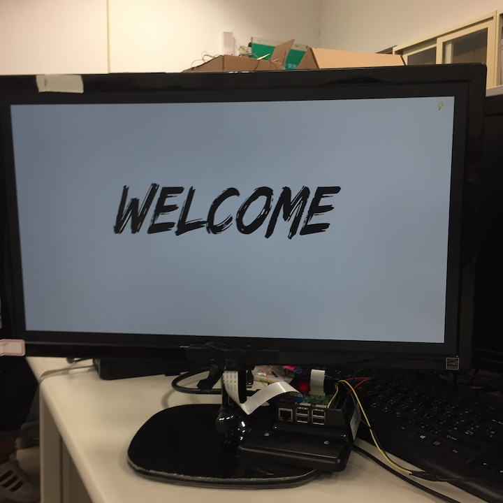
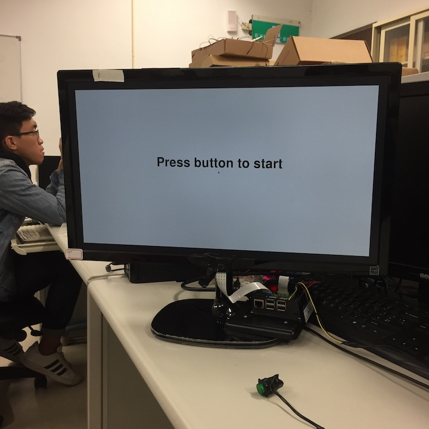

# 2018Fall-VisionChecker

## Introduction

As technology grows speedily, people start giving more and more tasks to machines, saving human resources for more valuable missions. We observed that one of the common replacable job is operating the vision check in usual eye clinics. Our goal is to build a device that can auto detect the hand movemet of the user and calculate the correponding vision level of the tester.

## Features
1. Light-weighted. Easy to setup and doesn't require special equipments.
2. Can be operated by the tester himself. Doesn't require one more operator.
3. The application loops itself and doesn't require setup time when switching users.

## Usage
1. Turn on the device. Sit at about 2 meters apart, right in front of the camera.
2. After seeing **WELCOME**, press the button to start up.
3. Adjust your post so that your image is in the middle of the screen.
4. Start the Vision test! Wave your hand to increase the accuracy of detection.
5. After the test is finished, your result will be shown on the screen.
6. Press button to restart for the next user.

## Demo

<iframe width="560" height="315" src="https://www.youtube.com/embed/DkFuoJ_HVvo" frameborder="0" allow="accelerometer; autoplay; encrypted-media; gyroscope; picture-in-picture" allowfullscreen></iframe>

## Dependency
* Rpi 3
* A monitor (connected with HDMI)
* A button
* python >= 3.5
* opencv-python
* PIL
* tkinter
* RPi.GPIO
* picamera

## Implementation
* Tkinter for building the user interface.
* Collect the images and resize them according to the standard of Snellen Chart. 
* GPIO for connecting the start button.
* Recompile opencv-python to optimize performance on RPi.
* Area substraction for motion detection.
* Every time a new test image shows up, there will be a short delay that allows user to look and think. This delay grows as the image size becomes smaller and smaller.

## Develop Process 

### Motion Recognization Method

#### Using Neural Network
We refer the [websites](https://towardsdatascience.com/how-to-build-a-real-time-hand-detector-using-neural-networks-ssd-on-tensorflow-d6bac0e4b2ce) which build the network for hand tracking, and here you can find their [github page](https://github.com/victordibia/handtracking).

#### Using traditional CV method

##### HSV for skin detection

You can refer to this [website](https://www.pyimagesearch.com/2014/08/18/skin-detection-step-step-example-using-python-opencv/) for  more information.

##### Simple difference for two frame

We propose a very simple solution that just calculate the abs difference between two frame, and apply some filter to blur and threshold to let our frame more clean.

### Problem Faced
#### Neural Netowrk

This method is extremely **slow** which may delay for almost 5~10 sec on Rpi , and that means it is incapable for real-time usage.

#### HSV

This method need to know how far is the distance from the user to screen and where is the hand position at initial frame, or it can use the above neural network to find the hand position. It seems fine to use the neral network for only first frame. Nevertheless, eventually the result isn't accurate enough for testing which may delay for 2 sec.

#### Aera selection in our method

At first, we split the frame into **Up Area** and **Down Area** with the horizontal line, and **Left Area** and **Right Area** with  vertical line in the middle point. However, it is inaccurate when testing motion toward left and right. 

As a result, for **Up Area** and **Down Area**, we additionaly split two more vertical line in one quarter line and third quarter place.  for **Left Area** and **Right Area**, we additionaly split two more horizontal line in one quarter line and third quarter place.  

